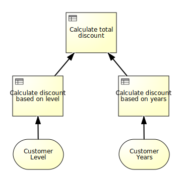

This project is designed to showcase how the Signavio Process Manager exported artifacts can be used to actually execute the decision logic.
The execution engine we use in our examples is the one provided by RedHat (https://www.drools.org/).
Please consult the documentation provided there for any engine specific questions.

## Setup
This project is self-contained and does not need any external configuration.

After checking out the repository via:
```
git clone git@github.com:signavio/dmn-and-drools-execution-examples.git
``` 
the project can be imported into your preferred IDE.

## Project Structure
#### Entry Point
com.signavio.examples.SignavioExamples

This class lets you execute all prepared examples in one go.

#### Resources
All resources we use, mainly the decision logic in either .drl or .dmn form and
the json files exported from the Signavio Test Lab, are stored in the resources folder under com.signavio.examples.

To make the examples easier to understand, we use the following decision diagram in nearly all cases.




#### Examples
All the examples we provide are located in there respective packages under 
**com.signavio.examples.drl** and **com.signavio.examples.dmn** respectively.

For the execution of .drl files the following examples exist
* **SimpleDrlExample** shows the most basic form of setting input values and retrieving all the outputs

* **OwnTypesDrlExample** makes use of classes external to the .drl file

* **DrlWithTestCasesExample** additionally executes a set of testcases exported from the Signavio Test Lab

* **DynamicSandboxDrlExample** configures the knowledge base dynamically instead of using the kmodules.xml files for that (this example is **not** using the DMN diagram mentioned above)

* **DrlSandbox** lets you play around with different .drl files (this example is **NOT** using the DMN diagram mentioned above)

Both sandbox examples are using com/signavio/examples/drl/sandbox/Sandbox.drl as there source.

For the execution of .dmn files the following examples exist
* **SimpleDmnExample** shows the most basic form of setting input values and retrieving outputs

* **DmnWithTestCasesExample** additionally executes a set of testcases exported from the Signavio Test Lab

#### Signavio Artifacts
##### .dmn
When exporting DMN diagrams from the Signavio Process Manager as .dmn files you will receive a single artifact, 
the .dmn file itself.
You can directly use this file as the source of your knowledge base.

It is adviseable to have a look into the exported file because the Signavio Process Manager is uniquely naming all the 
importent variables like input data. The information if something in the diagram was renamed because of unsupported 
characters or duplicate names is needed to ensure that when setting input values or retrieving specific outputs the 
correct value is used.

For example, in case you define two different input data and name them both **my value**, both of them will be renamed 
to **myValue** and **myValue2** respectively.

##### .drl
When exporting DMN diagrams from the Signavio Process Manager as .drl files you will receive an archive containing the
exported rules (.drl), a manifest file and a formulae .jar file.

Those artifacts serve different purposes during the execution. The .drl file is used as the source of your 
knowledge base and describes the decision logic itself. The formulae .jar must be made available to the execution engine
because it contains function definitions for the drools execution. Using the manifest file is optional but advised.

## Walkthrough
