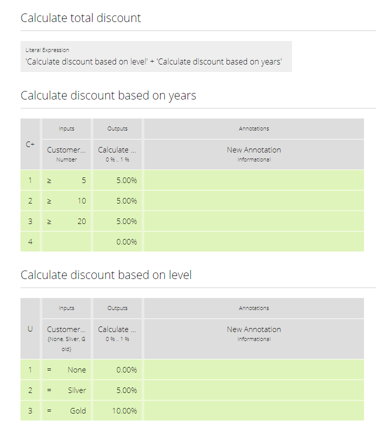

This project is designed to showcase how the Signavio Process Manager exported artifacts can be used to actually execute the decision logic.
The execution engine we use in our examples is the one provided by RedHat (https://www.drools.org/).
Please consult the documentation provided there for any engine specific questions.

## Setup
This project is self-contained and does not need any external configuration.

After checking out the repository via:
```
git clone git@github.com:signavio/dmn-and-drools-execution-examples.git
``` 
the project can be imported into your preferred IDE.

## Project Structure
#### Entry Point
com.signavio.examples.SignavioExamples

This class lets you execute all prepared examples in one go.

#### Resources
All resources we use, mainly the decision logic in either .drl or .dmn form and
the json files exported from the Signavio Test Lab, are stored in the resources folder under com.signavio.examples.

To make the examples easier to understand, we use the following decision diagram in nearly all cases.




#### Examples
All the examples we provide are located in there respective packages under 
**com.signavio.examples.drl** and **com.signavio.examples.dmn** respectively.

For the execution of .drl files the following examples exist
* **SimpleDrlExample** shows the most basic form of setting input values and retrieving all the outputs

* **OwnTypesDrlExample** makes use of classes external to the .drl file

* **DrlWithTestCasesExample** additionally executes a set of testcases exported from the Signavio Test Lab

* **DynamicSandboxDrlExample** configures the knowledge base dynamically instead of using the kmodules.xml files for that (this example is **not** using the DMN diagram mentioned above)

* **DrlSandbox** lets you play around with different .drl files (this example is **NOT** using the DMN diagram mentioned above)

Both sandbox examples are using com/signavio/examples/drl/sandbox/Sandbox.drl as there source.

For the execution of .dmn files the following examples exist
* **SimpleDmnExample** shows the most basic form of setting input values and retrieving outputs

* **DmnWithTestCasesExample** additionally executes a set of testcases exported from the Signavio Test Lab

#### Signavio Artifacts
##### .dmn
When exporting DMN diagrams from the Signavio Process Manager as .dmn files you will receive a single artifact, 
the .dmn file itself.
You can directly use this file as the source of your knowledge base.

It is adviseable to have a look into the exported file because the Signavio Process Manager is uniquely naming all the 
importent variables like input data. The information if something in the diagram was renamed because of unsupported 
characters or duplicate names is needed to ensure that when setting input values or retrieving specific outputs the 
correct value is used.

For example, in case you define two different input data and name them both **my value**, both of them will be renamed 
to **myValue** and **myValue2** respectively.

##### .drl
When exporting DMN diagrams from the Signavio Process Manager as .drl files you will receive an archive containing the
exported rules (.drl), a manifest file and a formulae .jar file.

Those artifacts serve different purposes during the execution. The .drl file is used as the source of your 
knowledge base and describes the decision logic itself. The formulae .jar must be made available to the execution engine
because it contains function definitions for the drools execution. Using the manifest file is optional but advised.

## General Workflow
Both the execution of a .dmn file and a .drl file are similar in there general workflow.

#### Retrieving a knowledge base
The first step one has to take is retrieving a knowledge base. The examples show two different ways of achieving this.

##### configuring the knowledge base via kmodules.xml
The first way of defining the knowledge base is done via the kmodules.xml file located in resources/META-INF/
```xml
<kbase name="KnowledgeBaseName" packages="any.package.name1, any.package.name2">
  <ksession name="SessionName"/>
</kbase>
```
The knowledge base automatically parses all files located in the defined packages. This in turn also means that all
files are treated as a single source of decision logic.

##### configuring the knowledge base via API
In case the kmodules.xml is not sufficient because the knowledge base has to be configured dynamically, you can also
create it via an API.
```java
private KieSession newKieSession(Reader drlReader) {
    InternalKnowledgeBase knowledgeBase = KnowledgeBaseFactory.newKnowledgeBase();
		
    KnowledgeBuilder knowledgeBuilder = KnowledgeBuilderFactory.newKnowledgeBuilder();
    knowledgeBuilder.add(ResourceFactory.newReaderResource(drlReader), ResourceType.DRL);
    knowledgeBase.addPackages(knowledgeBuilder.getKnowledgePackages());
		
    return knowledgeBase.newKieSession();
}
```
This allows for a more dynamic way of configuring the knowledge base and supports usecases where the .drl and .dmn
files are not present/available when triggering the application.

#### Setting inputs
After retrieving a session from a configured knowledge base, the input values for the execution must be set.
Depending on wether you want to execute a .drl or .dmn file, the way of setting those differs slightly.

##### .dmn
Setting input values for a .dmn file execution, named key-value pairs are past to a DMNContext that can be 
retrieved from the session.
```java
protected DMNContext createDmnContext() {
    DMNContext dmnContext = getDmnRuntime().newContext();
	
    // setting values for inputs
    dmnContext.set("name", "John Doe");
    dmnContext.set("age", 35);	

    return dmnContext;
}
```

##### .drl
Setting input values for a .drl file execution, the input objects must be constructed and inserted into the session.
This is done by retrieving the type of the object (so called fact type), instantiating an object with that and setting
all the fields.
```java
try {
    // creating input object defined in the .drl file
    FactType inputType = getInputFactType();
    Object input = inputType.newInstance();
			
    // setting all given values to there respective fields
    inputType.set(input, "name", "John Doe");
    inputType.set(input, "age", 35);

    return input;
} catch (InstantiationException | IllegalAccessException e) {
    throw new RuntimeException(e);
}
```
This object is afterwards inserted into the session by
```java
ksession.insert(input);
```
In order to figure out which fact types are available and which fields belong to them you can consult the manifest file
available inside the exported archive.

#### Triggering the execution
In both cases, triggering the actual execution is realy simple.

##### .dmn
In case of a .dmn file you trigger it by
```java
getDmnRuntime().evaluateAll(model, dmnContext);
```
providing the model you want to evaluate (available in the session) and the previously created context (input values).

##### .drl
In case of a .drl file you can simply trigger the evaluation by
```java
ksession.fireAllRules();
```
because all inputs are already set in the session.

#### Retrieving the outputs
After the execution has finished, the next step is to retrieve the produced output values.

##### .dmn
The evaluation of the decision logic mentioned above already returns the result.
```java
DMNResult result = getDmnRuntime().evaluateAll(model, dmnContext);
```
This result can then be used to retrieve the actual output values.
Important to note is that this result contains the intermediate results of all decisions as well.

##### .drl
In case of a .drl file, the evaluation does not automatically return the result. In order to get access to it one can
retrieve all the available objects from the session.
```java
ksession.getObjects();
```
The session also provides some methods to filter for specific
types of objects.

## Test Suite Testcases
The Signavio Process Manager has the possibility to export testcases defined in the Signavio Test Suite.
The exported .json representation of the test case looks like the one provided in
resources/com/signavio/examples/dmn/simple/Simple-TestLab.json.
Those files basically contain a number of input definitions that can be used to figure out which inputs to set
```json
"inputParameterDefinitions": [
  {
    "id": "cb7e33e39ee644da9a4bb48b1cc74e65/sid-D7DF30A5-56A7-4043-86FC-EF3595C49355",
    "shapeId": "sid-D7DF30A5-56A7-4043-86FC-EF3595C49355",
    "diagramId": "cb7e33e39ee644da9a4bb48b1cc74e65",
    "modelName": "Simple",
    "requirementName": "Customer Years"
  },
  {
    "id": "cb7e33e39ee644da9a4bb48b1cc74e65/sid-CE8F3937-3DA2-41AB-AF9C-B7F301C6D8E4",
    "shapeId": "sid-CE8F3937-3DA2-41AB-AF9C-B7F301C6D8E4",
    "diagramId": "cb7e33e39ee644da9a4bb48b1cc74e65",
    "modelName": "Simple",
    "requirementName": "Customer Level"
  }
]  
```
and a number of output definitions in the same format. The ids provided in the file can be used to find the
corresponding input in the .dmn and .drl files.
e.g.
```xml
<inputData name="customerLevel" sigExt:shapeId="sid-CE8F3937-3DA2-41AB-AF9C-B7F301C6D8E4" sigExt:diagramId="cb7e33e39ee644da9a4bb48b1cc74e65">
```

Additionally, those files contain a number of testcases with there respective input values and the expected outputs.
The order of those values is the same as in the input definitions. Meaning the first defined input value corresponds
to the first defined input definition.
```json
"testCases": [
  {
    "inputValues": [
      {
        "type": "number",
        "value": 0
      },
      {
        "type": "enumeration",
        "value": "0",
        "name": "None"
       }
    ],
    "expectedValues": [
      {
        "type": "number",
        "value": 0
      }
    ]
  }
]
``` 
In our examples we use the bdm-test-suite-api library to handle the .json files.